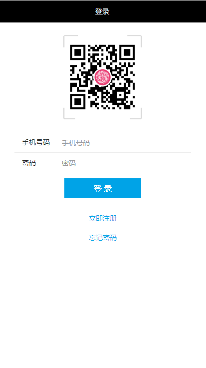
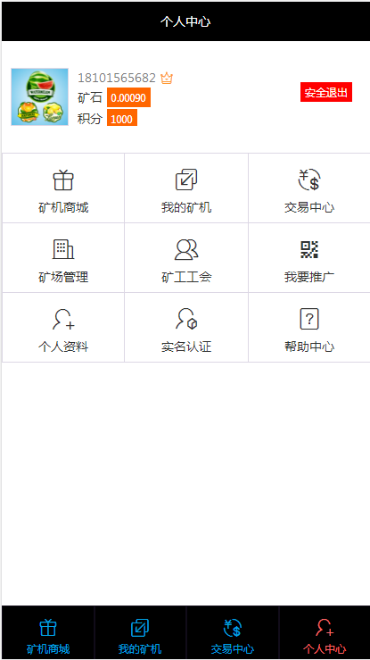
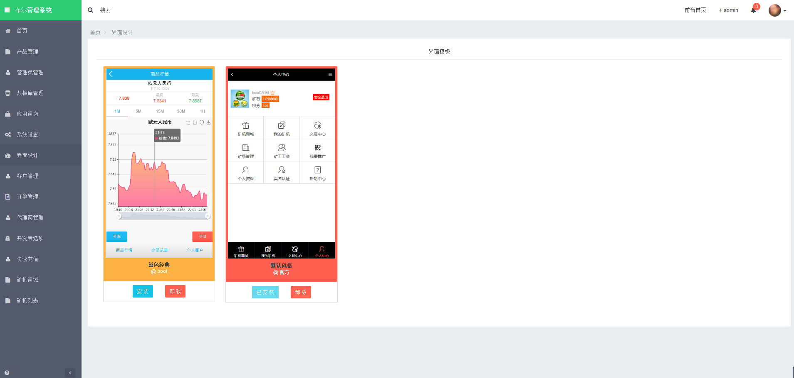
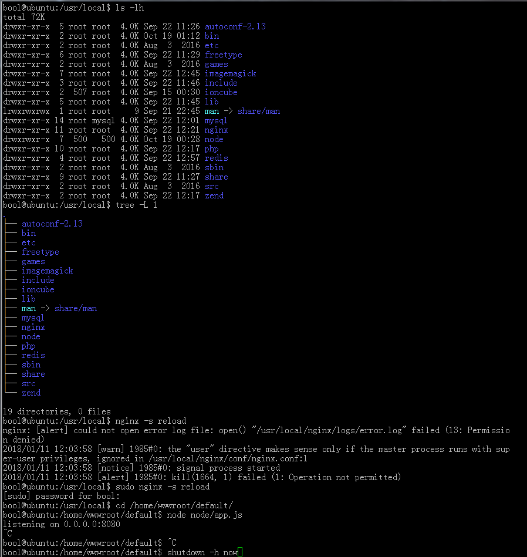

# Phalcon 云矿机

基于 Phalcon 框架开发的云矿机管理系统，采用 MySQL + Redis 技术栈。

## 项目简介

云矿机是一个提供虚拟矿机租赁和管理的平台，用户可以通过平台购买矿机、获取收益，支持会员管理、商品管理、订单管理等功能。

## 演示截图

| 首页 | 商品列表 |
|:---:|:---:|
|  |  |

| 用户中心 | 管理后台 |
|:---:|:---:|
|  |  |

## 技术栈

| 类别 | 技术 |
|:---|:---|
| 框架 | Phalcon |
| 数据库 | MySQL |
| 缓存 | Redis |
| 模板引擎 | Volt |
| 短信服务 | 云通讯 |

## 功能特性

| 模块 | 说明 |
|:---|:---|
| 用户管理 | 用户注册、登录、权限管理 |
| 商品管理 | 矿机商品添加、编辑、分类管理 |
| 订单管理 | 订单创建、支付、状态跟踪 |
| 财务管理 | 收益计算、提现管理 |
| 系统配置 | 网站配置、短信配置 |
| 数据库管理 | 数据库备份、还原 |

## 目录结构

```
phalcon_kuang/
├── app/                      # 应用目录
│   ├── backend/              # 后台管理系统
│   │   ├── controllers/      # 控制器
│   │   ├── models/          # 数据模型
│   │   ├── plugins/         # 插件 (验证码、数据库)
│   │   ├── repositories/    # 数据仓库
│   │   ├── validations/     # 数据验证
│   │   └── views/           # 视图模板
│   ├── frontend/             # 前端应用
│   │   ├── controllers/     # 控制器
│   │   ├── models/         # 数据模型
│   │   ├── plugins/sms/    # 短信插件
│   │   ├── repositories/   # 数据仓库
│   │   └── views/          # 视图模板
│   ├── config/             # 配置文件
│   ├── library/            # 公共类库
│   │   ├── Curl.php       # HTTP 请求
│   │   ├── Encrypt.php    # 加密解密
│   │   ├── REST.php       # REST API
│   │   └── SinaApi.php    # 新浪 API
│   ├── help/              # 辅助函数
│   └── backup/            # 数据库备份
├── public/                 # 静态资源
│   ├── admin/             # 后台资源
│   ├── static/            # 前端静态文件
│   ├── layer/             # 弹窗组件
│   └── index.php          # 入口文件
└── demo/                  # 演示截图
```

## 后端模块

### 控制器 (Backend)

| 控制器 | 功能 |
|:---|:---|
| IndexController | 首页统计 |
| AdminController | 管理员管理 |
| LoginController | 登录/登出 |
| ConfController | 系统配置 |
| DatabaseController | 数据库管理 |
| ProductController | 商品管理 |
| StoreController | 库存管理 |
| ShopController | 店铺管理 |
| UserController | 用户管理 |
| UiController | 界面管理 |

### 数据模型 (Models)

| 模型 | 说明 |
|:---|:---|
| Admin | 管理员模型 |
| User | 用户模型 |
| Product | 商品模型 |
| ProductCate | 商品分类模型 |
| Conf | 配置模型 |
| Menu | 菜单模型 |
| Api | API 模型 |

## 前端模块

### 控制器 (Frontend)

| 控制器 | 功能 |
|:---|:---|
| IndexController | 首页/商品列表 |
| LoginController | 用户登录/注册 |
| UserController | 用户中心 |
| MyController | 个人中心 |
| PayController | 支付处理 |
| MsmController | 短信验证 |

## 配置说明

数据库配置位于 `app/config/config.php`：

```php
return array(
    'database' => array(
        'adapter'  => 'Mysql',
        'host'     => 'localhost',
        'username' => 'root',
        'password' => 'root',
        'dbname'   => 'gec',
        'charset'  => 'utf8',
    ),
    'baseUri' => 'http://localhost',
    'theme'   => 'default',
);
```

## 许可证

MIT License
